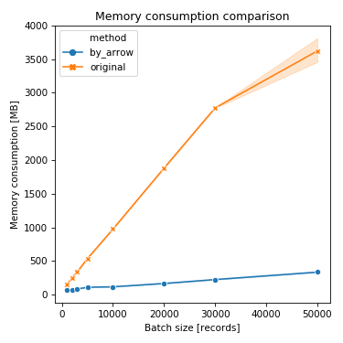
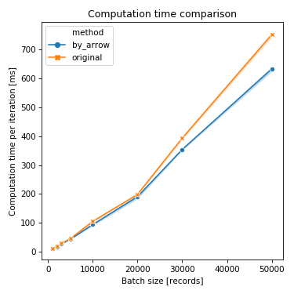

# ActiveRecord with Arrow PoC

## What is this?

This is the proof-of-concept optimization of AR's pluck method.  This employs Apache Arrow's RecordBatch type as the internal representation of AR::Result.  By this optimization, the memory consumption of the pluck method is reduced 2.38x for the batch size 1000, and 11.6x for the batch size 50000.  The change does not affect on the calculation speed.

  

## Author

Kenta Murata

## License

MIT
