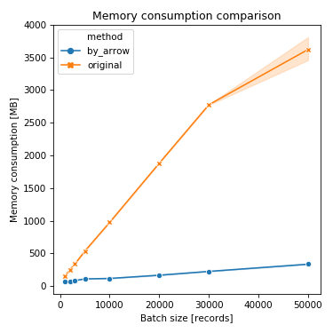

# Reducing memory footprint of `pluck` method of ActiveRecord by using Apache Arrow

- Author: Kenta Murata at Speee, Inc.
- Date: 2018-12-25

I'm not English-native.  If you find incorrect English usage in this article, please give me your feedback as issues.

## tl;dr

- The proof-of-concept optimization of AR's `pluck` method is demonstrated
- Apache Arrow's RecordBatch type is used as the internal representation of AR::Result
- The memory consumption is tremendously reduced than the original implementation
- The computation time is slightly reduced than the original implementation

## Background

### `pluck` method of ActiveRecord

ActiveRecord provides `pluck` method to obtain one or few field values as arrays from a table.  The `pluck` method can reduce memory consumption than the use of finder methods because it does not generate model instances.

The example usage of the `pluck` method is below:

```ruby
User.where(admin: false).limit(10).pluck(:id, :name)
```

This code obtains arrays of pairs of id and name fields of the first 10 non-admin users.  The result is like the below array:

```ruby
[[3, "Felton Lakin"], [4, "Harriette Metz"], [6, "Ronnie Wisozk"], ...]
```

This result can be obtained by the use of finder methods and chaining `map` method like the following code:

```ruby
User.where(admin: false).limit(10).map {|u| [u.id, u.name] }
```

However, this consumes more memory and more computation time than the `pluck` version. The reason is this generates instances of User class for each row of the result. Moreover, this takes all the columns in the `users` table from the DB for generating the instances even though the result needs only `id` and `name`.

Reducing the number of taking columns can be achieved by using `select` method:

```ruby
User.where(admin: false).select(:id, :name).limit(10).map {|u| [u.id, u.name] }
```

But, this is not as well as memory efficient as the `pluck` version.  This means the `pluck` method is very important in Rails application to reduce memory consumption.

### RecordBatch of Apache Arrow

RecordBatch type is the core of Apache Arrow's data structure for representing table-like data.  A RecordBatch consists of a Schema and a vector of Array.  Schema type is used for representing a table schema.  Its object consists of a vector of Field, which consists of the name and the data type of the field.  Array type is used for representing a Column of a table.  It has the number of rows, the number of null values, and the actual values for each cell of the column.

RecordBatch represents a table-like data as the column-major format.  Since MySQL's client library (libmysqlclient) provides only accessing APIs in row-major format, we need to convert the data from row-major into column-major to produce RecordBatch data from MySQL's query result.

## Method

### Optimization strategy

In the original pluck method, the query result that comes from the connection adapter is converted to two arrays for generating ActiveRecord::Result object.  One is the array of fields, the pairs of the column name and the data type, and the other is the array of rows.

The optimized version cancels these array generation by using RecordBatch object of Apache Arrow.

### Generating RecordBatch from a query result

To achieve the optimization, a RecordBatch is needed to be generated from a query result, that comes from the connection adapter.  For that purpose, the `to_arrow` method is provided as a instance method of Mysql2::Result class.  The implementation of `to_arrow` method is written in C++, and it is incomplete, but minimal for the experiments performed below.

The supported RDBMS in this repository is only MySQL, but the other RDBMS such as PostgreSQL can be supported in theory.

### Converting RecordBatch to Array of records

To generate the result of the optimized version of pluck method, the conversion of RecordBatch to Ruby's Array is necessary.
Arrow::RecordBatch class is provided by [red-arrow gem](https://github.com/apache/arrow/tree/master/ruby), and this class has `to_a` method.  However this `to_a` method is very slow because it is actually Enumerable's method and uses `each` method.

To avoid the use of `each` method, the special version of `to_a` method written in C++ is supplied.  The implementation of `to_a` method is incomplete, but minimal for the experiments performed below as `to_arrow` described above.

## Experiments

The following two experiments will be performed here.

1. Memory consumption comparison
2. Computation time comparison

All the measurements is performed by `benchmark-driver` command provided by [benchmark\_driver gem](https://github.com/benchmark-driver/benchmark-driver).

### Experimental condition

#### Execution environment

All the experiments are performed on the author's MacBook Pro (15-inch, 2016), which consists of 2.9GHz Core i7 processor and 16GB memory.

The prerequisits of all the experiments is listed below:

- Ruby 2.3.5
- MySQL 8.0.12
- Apache Arrow 0.11.1
- Apache Arrow GLIB 0.11.1
- Gem libraries listed in [Gemfile.lock](../Gemfile.lock)

#### benchmark-driver's setting

For each experiment, the following YAML data is used for the setting of benchmark-driver, which is stored as [driver.yml](../benchmark/driver.yml).

```yaml
prelude: |
  $LOAD_PATH.unshift Dir.pwd
  require 'prelude'
  n = Integer(ENV.fetch('LIMIT', '10000'))

benchmark:
  by_arrow: Mysql2Test.test_pluck_by_arrow(n)
  original: Mysql2Test.test_pluck(n)

loop_count: 100
```

### Memory consumption comparison experiment

Memory consumption is measured by the `memory` runner of benchmark-driver.  This runner uses the maximum RSS value reported by `time` command with `-l` option on macOS, that reports the rusage structure (See getrusage(3)).

The benchmark can be executed by the followin command line.

```
bundle exec benchmark-driver --rbenv '2.5.3' --bundler -r memory driver.yml
```

In the actual experiment, the follwoing script (saved as [memory\_runner.sh](../benchmark/memory_runner.sh)) is used for observe the trends for the changes of the batch size between 1,000 and 50,000.

```sh
for i in 1000 2000 3000 5000 10000 20000 30000 50000; do
  echo ===== LIMIT=$i =====
  LIMIT=$i bundle exec benchmark-driver --rbenv '2.5.3' --bundler -r memory driver.yml
done
```

#### Result

The raw result is saved as [memory.log](../benchmark/memory.log) in the repository.  The following figure is drawn by [plot\_memory\_result.rb](../benchmark/plot_memory_result.rb) script.



In this figure, the curve with circle marks, which labeld `by_arrow` in the legend, illustrates the trend of Apache Arrow version of `pluck` method.  On the other hand, the curve with cross marks, which labeld `original` in the legend, illustrates the trend of the original `pluck` method.

The figure clearly shows the Apache Arrow version tremendously reduces the memory consumption.  The following table shows the average memory consumption for each pair of the batch size and the method.  The most right column in the table shows the efficiency of the memory consumption of the Arrow version compared to the original version.  The efficiency of the Arrow version is more than 2x for all the cases, and the most efficient case is more than 12x.

**The average memory consumption**

| limit | by\_arrow [MB] | original [MB] | ratio |
| ----- | ----------:| -----------:| -----:|
| 1000  |  65.739162 |  155.206451 | 2.361x |
| 2000  |  74.008166 |  254.853120 | 3.444x |
| 3000  |  86.625485 |  341.478605 | 3.942x |
| 5000  | 111.945318 |  537.368986 | 4.800x |
| 10000 | 119.114138 |  976.176742 | 8.195x |
| 20000 | 168.812544 | 1880.996250 | 11.14x |
| 30000 | 226.839757 | 2774.773760 | 12.23x |
| 50000 | 337.079501 | 3618.711962 | 10.74x |

### Computation time comparison experiment

Computation time is measured by the `time` runner of benchmark-driver.  The example command line is below:

The benchmark can be executed by the followin command line.

```
bundle exec benchmark-driver --rbenv '2.5.3' --bundler -r time driver.yml
```

In the actual experiment, the follwoing script (saved as [speed\_runner.sh](../benchmark/speed_runner.sh)) is used for observe the trends for the changes of the batch size between 1,000 and 50,000 as the memory experiment above.

```sh
for i in 1000 2000 3000 5000 10000 20000 30000 50000; do
  echo ===== LIMIT=$i =====
  LIMIT=$i bundle exec benchmark-driver --rbenv '2.5.3' --bundler -r time driver.yml
done
```

#### Result

The raw result is saved as [speed.log](../benchmark/speed.log) in the repository.  The following figure is drawn by [plot\_speed\_result.rb](../benchmark/plot_speed_result.rb) script.


In this figure, the curve with circle marks, which labeld `by_arrow` in the legend, illustrates the trend of Apache Arrow version of `pluck` method.  On the other hand, the curve with cross marks, which labeld `original` in the legend, illustrates the trend of the original `pluck` method.

The figure shows the Apache Arrow version is not slower than the original version for all the cases.  The difference among the methods increases as the batch size raisen.

## Conclusion

The proof-of-concept optimization of `pluck` method using Apache Arrow is demonstrated.  Memory and computation time consumptions are compared to the original version of `pluck` method.  The result illustrates the optimized version is highly efficient in the memory consumption, and slightly efficient in the computation time consumption.
